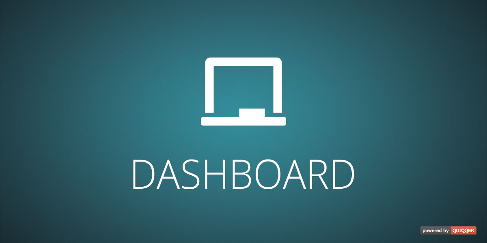

---
Dashboard for the QUIQQER System

Package name:

    quiqqer/dashboard

Features
--------

- Quick overview of important statistics like:
    - Project-, Page-, User-, Group-Count
    - Last changed pages
    - Last logged in users
    - System information
    - Filesystem information
    - CRON history
    - and many more...
- Can be extended by other packages

Installation
------------

The package name is: quiqqer/dashboard

Contribute
----------

- Project: https://dev.quiqqer.com/quiqqer/dashboard
- Issue Tracker: https://dev.quiqqer.com/quiqqer/dashboard/issues
- Source Code: https://dev.quiqqer.com/quiqqer/dashboard/tree/master
- Wiki: https://dev.quiqqer.com/quiqqer/dashboard/wikis/home

Support
-------

If you found any flaws, have any wishes or suggestions you can send an email
to [support@pcsg.de](mailto:support@pcsg.de) to inform us about your concerns. 
We will try to respond to your request and forward it to the responsible developer.

License
-------

GPL-3.0+